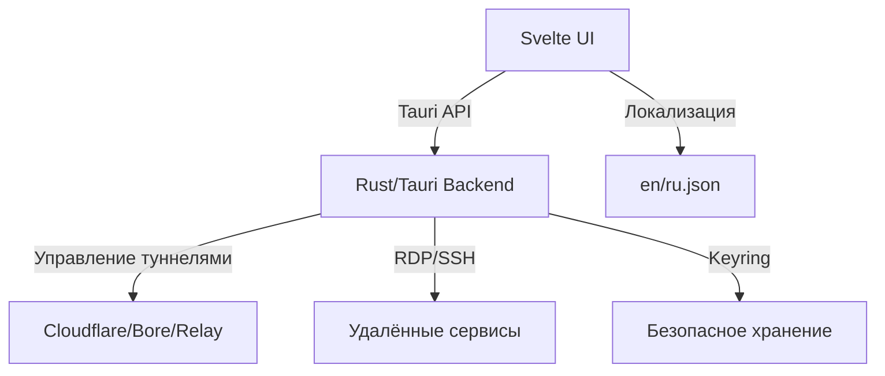

# 2GC Desktop Client

<div align="center">
    
</div>

---

## О проекте

**2GC Desktop Client** — кроссплатформенное десктопное приложение для безопасного управления туннелями (Cloudflare Tunnel, 2GC Relay, Bore Tunnel) и удалёнными сервисами (RDP, SSH) с современным интерфейсом на Svelte и нативным бэкендом на Rust (Tauri).

- Многоязычный интерфейс (русский/английский)
- Безопасная аутентификация (JWT)
- Управление списком компаний и серверов
- Запуск/остановка туннелей (Cloudflare, Bore, Relay)
- Подключение к RDP и SSH через защищённые туннели
- Гибкая настройка параметров RDP
- Система уведомлений и статусов
- Интеграция с внешними сервисами поддержки
- Кроссплатформенность: Windows, macOS

Подробнее: см. [docs/PROJECT_OVERVIEW_RU.md](docs/PROJECT_OVERVIEW_RU.md)

---

## 🏗️ Архитектура



---

## 🛡️ Протоколы и безопасность
- Все соединения защищены (TLS 1.3)
- Аутентификация через JWT
- Безопасное хранение токенов и паролей
- Мониторинг состояния туннелей, автоматическое восстановление
- Подробнее о протоколе: [docs/RELAY_PROTOCOL.md](docs/RELAY_PROTOCOL.md)

---

## 🚀 Быстрый старт

### Системные требования
- Node.js >= 18
- pnpm (или npm/yarn)
- Rust (для desktop/Tauri)
- Windows 10/11 или macOS (WebView2 для Windows)
- Для туннелей: бинарники cloudflared, bore (см. [docs/PROJECT_OVERVIEW_RU.md](docs/PROJECT_OVERVIEW_RU.md))

### Установка и запуск

1. Клонируйте репозиторий:
```bash
git clone https://github.com/mlanies/2gc-desktop-client.git
cd 2gc-desktop-client
```
2. Установите зависимости:
```bash
pnpm install
# или npm install
```
3. Запустите веб-приложение (Svelte/Vite):
```bash
pnpm run dev
# или npm run dev
```
4. Для desktop-версии (Tauri):
- Установите [Rust](https://www.rust-lang.org/tools/install) и [Tauri CLI](https://tauri.app/v1/guides/getting-started/prerequisites/):
```bash
cargo install tauri-cli
```
- Запустите desktop-версию:
```bash
pnpm tauri dev
# или npm run tauri dev
```

---

## 🏗️ Сборка и деплой

- Сборка веб-приложения:
```bash
pnpm run build
```
- Сборка desktop-приложения (Tauri):
```bash
pnpm tauri build
```
- Бинарные файлы появятся в `src-tauri/target/release/`

---

## 📁 Структура проекта

- `src/` — фронтенд (Svelte, SvelteKit)
  - `lib/` — компоненты интерфейса
  - `pages/` — страницы и вкладки
  - `routes/` — маршрутизация
  - `store/` — глобальное состояние
  - `locales/` — локализация
  - `types.ts` — типы данных
- `src-tauri/` — бэкенд (Rust/Tauri)
  - `src/` — исходники Rust
  - `binaries/` — внешние бинарники (cloudflared, bore)
  - `icons/` — иконки
  - `tauri.conf.json` — конфиг Tauri
- `docs/` — документация

---

## 📖 Документация
- [docs/PROJECT_OVERVIEW_RU.md](docs/PROJECT_OVERVIEW_RU.md) — подробный технический обзор
- [docs/RELAY_PROTOCOL.md](docs/RELAY_PROTOCOL.md) — описание протокола 2GC Relay

---

## ❓ FAQ

**Q: Как подключиться к серверу?**
A: Выберите сервер, нажмите "Подключиться", введите учётные данные и следуйте инструкциям.

**Q: Безопасно ли сохранять пароли?**
A: Все учётные данные шифруются и хранятся локально с использованием keyring/config.

**Q: Что делать при ошибках запуска туннеля?**
A: Проверьте наличие бинарников cloudflared/bore, права доступа, обратитесь в поддержку.

**Q: Как сменить язык интерфейса?**
A: В настройках приложения выберите нужный язык (русский/английский).

---

## 🤝 Contributing

Будем рады любым улучшениям и pull request!
1. Форкните репозиторий
2. Создайте ветку (`git checkout -b feature/your-feature`)
3. Внесите изменения
4. Оформите pull request

Перед отправкой:
- Проверьте код через `pnpm lint`
- Оформите коммиты понятно
- Описывайте изменения в PR

---

## 🆘 Контакты и поддержка
- [Сайт 2GC](https://2gc.ru)
- [Telegram Support](https://t.me/suppport2gc_bot)

---

## 📝 Лицензия

2GC Desktop Client распространяется под лицензией [MIT](LICENSE).
