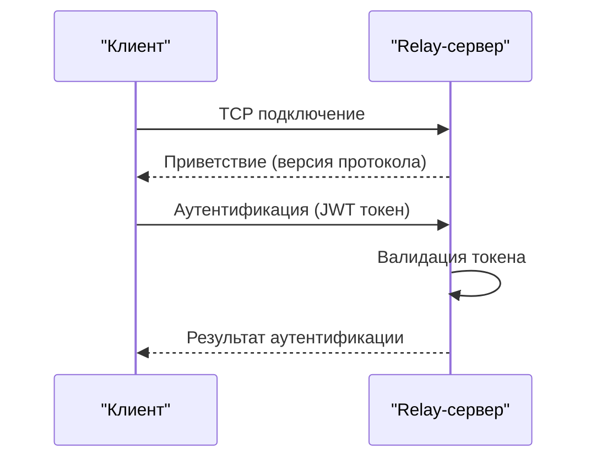
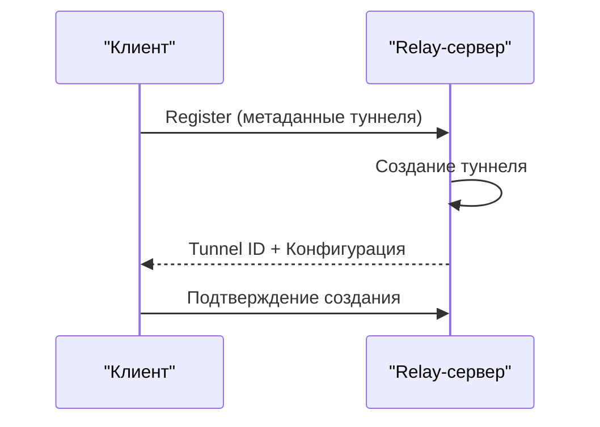
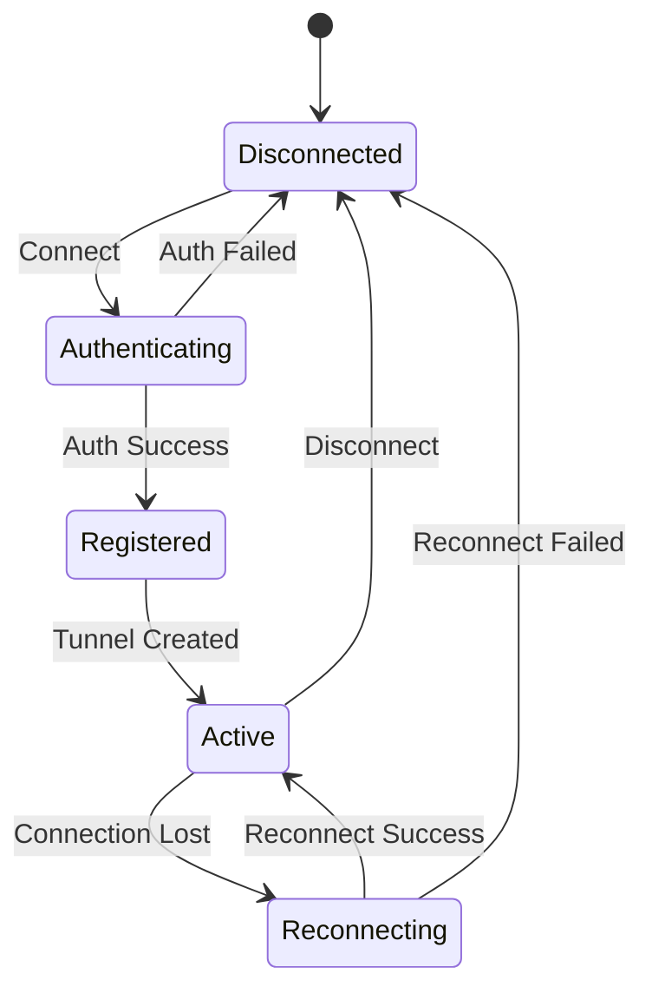

# Протокол взаимодействия между Relay-сервером и клиентом

## 1. Протокол взаимодействия

### 1.1. Инициализация подключения


### 1.2. Регистрация туннеля


## 2. Форматы сообщений

### 2.1. Аутентификация
```json
// От клиента к серверу
{
    "type": "auth",
    "token": "jwt_token",
    "version": "1.0",
    "client_info": {
        "os": "windows",
        "version": "1.0.0"
    }
}

// Ответ сервера
{
    "type": "auth_response",
    "status": "success",
    "server_info": {
        "version": "1.0.0",
        "features": ["tunnel", "monitoring"]
    }
}
```

### 2.2. Регистрация туннеля
```json
// От клиента к серверу
{
    "type": "register",
    "tunnel_info": {
        "name": "server_name",
        "protocol": "tcp",
        "ports": [3389, 22],
        "public_key": "base64_public_key"
    }
}

// Ответ сервера
{
    "type": "register_response",
    "status": "success",
    "tunnel_id": "uuid",
    "config": {
        "endpoint": "relay.2gc.ru:443",
        "public_key": "server_public_key",
        "allowed_ips": ["10.0.0.0/24"]
    }
}
```

## 3. Состояния туннеля

### 3.1. Жизненный цикл


### 3.2. Мониторинг состояния
```json
// Heartbeat от клиента
{
    "type": "heartbeat",
    "tunnel_id": "uuid",
    "stats": {
        "bytes_in": 1024,
        "bytes_out": 2048,
        "connected_since": "timestamp"
    }
}

// Ответ сервера
{
    "type": "heartbeat_response",
    "status": "ok",
    "server_time": "timestamp"
}
```

## 4. Обработка ошибок

### 4.1. Коды ошибок
```python
ERROR_CODES = {
    'AUTH_FAILED': 1001,
    'INVALID_TOKEN': 1002,
    'TOKEN_EXPIRED': 1003,
    'TUNNEL_EXISTS': 2001,
    'INVALID_CONFIG': 2002,
    'RATE_LIMIT': 3001,
    'SERVER_ERROR': 5000
}
```

### 4.2. Формат ошибки
```json
{
    "type": "error",
    "code": 1001,
    "message": "Authentication failed",
    "details": {
        "reason": "invalid_token",
        "retry_after": 60
    }
}
```

## 5. Безопасность

### 5.1. Шифрование
- Все соединения должны быть зашифрованы (TLS 1.3)
- Использование постоянных ключей для аутентификации
- Проверка подписи всех сообщений

### 5.2. Ограничения
```python
RATE_LIMITS = {
    'auth_attempts': 5,  # попыток в минуту
    'tunnel_creation': 10,  # туннелей в час
    'heartbeat': 30  # секунд между heartbeat
}
```

## 6. Восстановление соединения

### 6.1. Стратегия переподключения
```python
RECONNECT_STRATEGY = {
    'initial_delay': 1,  # секунд
    'max_delay': 30,  # секунд
    'max_attempts': 10,
    'backoff_factor': 2
}
```

### 6.2. Сохранение состояния
```json
{
    "tunnel_id": "uuid",
    "last_config": {
        "endpoint": "relay.2gc.ru:443",
        "public_key": "server_public_key"
    },
    "reconnect_token": "temporary_token"
}
```

## 7. Мониторинг и логирование

### 7.1. Метрики
```python
METRICS = {
    'connection_time': 'gauge',
    'bytes_transferred': 'counter',
    'active_tunnels': 'gauge',
    'error_rate': 'rate'
}
```

### 7.2. Логи
```python
LOG_FORMAT = {
    'timestamp': 'ISO8601',
    'level': 'INFO',
    'event': 'string',
    'tunnel_id': 'uuid',
    'details': 'object'
}
```

## 8. Примеры использования

### 8.1. Подключение клиента
```python
async def connect_to_relay(token):
    # Установка соединения
    reader, writer = await asyncio.open_connection(
        'relay.2gc.ru', 443, ssl=True
    )
    
    # Аутентификация
    auth_message = {
        'type': 'auth',
        'token': token
    }
    await send_message(writer, auth_message)
    response = await read_message(reader)
    
    if response['status'] == 'success':
        return await register_tunnel(reader, writer)
    else:
        raise AuthenticationError(response['message'])
```

### 8.2. Обработка на сервере
```python
async def handle_client_connection(reader, writer):
    try:
        # Чтение приветствия
        message = await read_message(reader)
        
        if message['type'] == 'auth':
            # Валидация токена
            if validate_token(message['token']):
                await send_message(writer, {
                    'type': 'auth_response',
                    'status': 'success'
                })
                return await handle_tunnel_registration(reader, writer)
            else:
                await send_error(writer, 'AUTH_FAILED')
    except Exception as e:
        logger.error(f"Connection error: {e}")
        await send_error(writer, 'SERVER_ERROR')
```

Этот документ описывает основную логику взаимодействия между Relay-сервером и клиентом. Он может быть расширен дополнительными деталями по мере необходимости. 